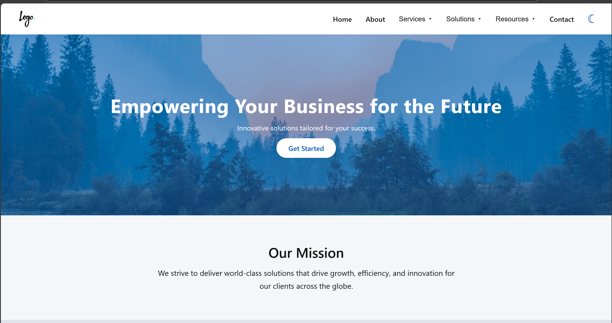

# Corporate Website Template

**Target audience:** UI/UX Developers

A clean, responsive HTML/CSS/JS template showcasing modern UI/UX patterns: light/dark mode, sticky header, responsive navigation, hero overlay, alternating sections, and accessible interactions.

---

## UI/UX Features

### 1. Light ↔ Dark Mode Toggle

Leverages CSS custom properties and a simple toggle button to switch themes, persisting user preference in `localStorage`.

```css
:root {
  /* Light theme */
  --light-bg: #f5f6fa;
  --light-text: #111;
  --light-primary: #0057b8;
  /* Dark theme */
  --dark-bg: #23272f;
  --dark-text: #f5f6fa;
  --dark-primary: #4ea1ff;
}

body {
  background: var(--light-bg);
  color: var(--light-text);
  transition: background 0.3s, color 0.3s;
}
body.dark-mode {
  background: var(--dark-bg);
  color: var(--dark-text);
}
```

```js
const themeToggle = document.querySelector(".theme-toggle");
function setTheme(dark) {
  document.body.classList.toggle("dark-mode", dark);
  localStorage.setItem("theme", dark ? "dark" : "light");
  themeToggle.innerHTML = dark ? "☀️" : "🌙";
}
themeToggle.addEventListener("click", () =>
  setTheme(!document.body.classList.contains("dark-mode"))
);
```

---

### 2. Sticky Header with Logo Alignment

Keeps the header in view on scroll; flex layout ensures the logo and controls stay aligned and spaced.

```css
.header {
  position: sticky;
  top: 0;
  display: flex;
  align-items: center;
  justify-content: space-between;
  padding: 0 16px;
  height: 56px;
  background: var(--light-header);
  box-shadow: 0 2px 8px rgba(0, 0, 0, 0.04);
  z-index: 1000;
}
.logo img {
  max-height: 36px;
}
```

---

### 3. Responsive Navigation

**Desktop:** horizontal nav with hover-activated dropdowns.
**Mobile:** hamburger button opens a slide-in menu overlay.

```html
<!-- Desktop nav -->
<nav class="nav" aria-label="Main navigation">
  <ul>
    <li class="nav-item">
      <button class="nav-link" aria-haspopup="true" aria-expanded="false">
        Services <span class="arrow">▾</span>
      </button>
      <div class="dropdown" role="menu">
        <a href="#">Consulting</a>
        <a href="#">Implementation</a>
      </div>
    </li>
    <!-- …other items… -->
  </ul>
</nav>

<!-- Mobile hamburger -->
<button class="hamburger" aria-label="Open menu">
  <span></span><span></span><span></span>
</button>
```

```js
// Toggle mobile menu
const hamburger = document.querySelector(".hamburger");
const mobileMenu = document.querySelector(".mobile-menu");
const overlay = document.querySelector(".overlay");
hamburger.addEventListener("click", () => {
  const open = mobileMenu.classList.toggle("active");
  overlay.classList.toggle("active", open);
  hamburger.setAttribute("aria-expanded", open);
  document.body.style.overflow = open ? "hidden" : "";
});
overlay.addEventListener("click", () => {
  mobileMenu.classList.remove("active");
  overlay.classList.remove("active");
  hamburger.setAttribute("aria-expanded", "false");
  document.body.style.overflow = "";
});
```

---

### 4. Hero Section with Color Overlay & CTA

Full-width background image with a semi-transparent overlay, centered text, and a rounded call-to-action button.

```css
.hero {
  position: relative;
  height: 260px;
  background: url("...") center/cover no-repeat;
  display: flex;
  align-items: center;
  justify-content: center;
  color: #fff;
}
.hero::after {
  content: "";
  position: absolute;
  inset: 0;
  background: rgba(0, 87, 184, 0.45);
  z-index: 1;
}
.hero-content {
  position: relative;
  z-index: 2;
}
.hero-cta {
  margin-top: 14px;
  padding: 12px 28px;
  background: #fff;
  color: var(--light-primary);
  border-radius: 30px;
  box-shadow: 0 2px 8px rgba(0, 0, 0, 0.08);
  transition: background 0.2s, color 0.2s;
}
.hero-cta:hover {
  background: var(--light-primary);
  color: #fff;
}
```

---

### 5. Alternating Section Backgrounds

Enhances visual rhythm by alternating light and slightly darker backgrounds.

```css
.section:nth-child(even) {
  background: var(--light-bg-alt);
}
.section:nth-child(odd) {
  background: var(--light-bg);
}
```

---

### 6. Accessibility & Keyboard Support

- **ARIA attributes** (`aria-label`, `aria-haspopup`, `aria-expanded`) on interactive elements
- **Keyboard**: ESC closes mobile menu
- **Focus management**: button.blur() to remove unwanted focus outlines on desktop dropdowns

```js
document.addEventListener("keydown", (e) => {
  if (e.key === "Escape" && mobileMenu.classList.contains("active")) {
    // close menu…
  }
});
```

---

## Getting Started

1. **Download the template**:
   [Download index.html](index.html)

2. **Preview**:
   Open `index.html` in your browser to see the responsive, theme-toggleable corporate template in action.
